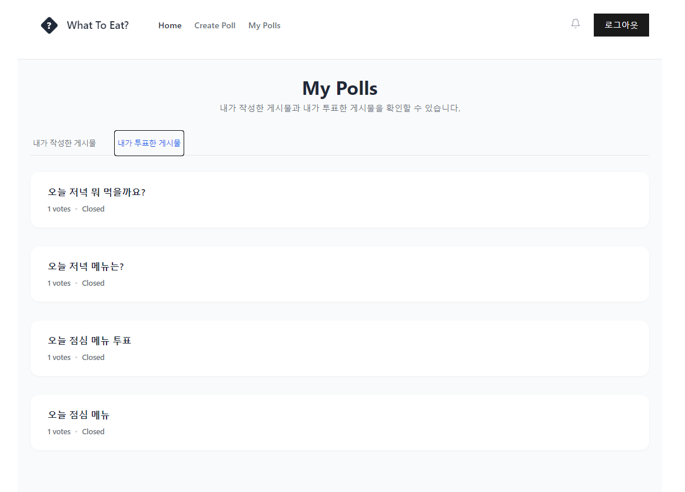

# WhatToEat

음식 투표 및 추천을 위한 커뮤니티 웹 애플리케이션입니다.
사용자는 다양한 음식 투표를 만들고, 참여하며, 결과를 확인할 수 있습니다.

> **이 프로젝트는 Turbo를 활용한 모노레포 구조로 구현되었습니다.**
> 프론트엔드(React)와 백엔드(Node.js, Express, Prisma 등)가 하나의 레포에서 통합관리됩니다.

<br>

## 화면 스크린샷

- 메인 페이지  
  
- 투표 상세 페이지  
  
- 투표 생성/수정  
  
  
- 로그인/회원가입  
  
  
- 마이페이지  
  


<br>

## 주요 기능

### 프론트엔드(React)
- 음식 투표 / 일반 게시글 목록, 검색, 페이징, 탭 필터(전체/진행중/마감)
- 투표 생성, 수정, 삭제 (투표 항목 2~10개, 중복 불가, 만료일 설정)
- 투표 참여 및 결과 실시간 반영
- 내 투표 / 내가 참여한 투표 목록
- 이메일 / 비밀번호 회원가입 및 로그인, 카카오 소셜 로그인
- JWT 기반 인증, 자동 로그인 유지, 로그아웃

### 백엔드(Node.js + Express)
- 게시글/투표 CRUD, 투표 참여/취소, 투표 결과 집계
- 회원가입, 로컬/카카오 로그인, JWT 발급/갱신, 프로필 조회
- 투표 만료 자동 처리(스케줄러 CRON 사용)
- 인증 미들웨어, 에러 핸들러

<br>

## 기술 스택

- **모노레포 관리**: Turbo
- **프론트엔드**: React, TypeScript, Vite, Tailwind CSS, React Router
- **백엔드**: Node.js, Express, TypeScript
- **인증**: Passport.js(Local, Kakao), JWT, httpOnly 쿠키

<br>

## 프로젝트 구조

```
WhatToEat/
  apps/
    frontend/   # 프론트엔드(React)
      src/
        pages/        # Home, Login, Signup, Create/Edit/Detail 등
        services/     # api.service.ts, auth.service.ts
        contexts/     # AuthContext.tsx
        components/   # Header, UI 컴포넌트
    backend/    # 백엔드(Node.js + Express)
      src/
        controllers/  # auth.controller.ts, post.controller.ts
        services/     # auth.service.ts, post.service.ts, jwt.service.ts
        routes/       # auth.routes.ts, post.routes.ts
        types/        # auth.types.ts, post.types.ts
        middlewares/  # 인증, 에러 핸들러
        scheduler/    # poll-expiry.scheduler.ts
        config/       # passport.config.ts, prisma.ts
  packages/     # 공통 타입, 설정 등
  turbo.json    # Turbo 모노레포 설정
```

<br>

## 설치 및 실행

### 1. 레포지토리 클론
```bash
git clone https://github.com/yourname/WhatToEat.git
cd WhatToEat
```

### 2. 패키지 설치
```bash
pnpm install
```

### 3. 환경 변수 설정
- `apps/backend/.env`
- `apps/frontend/.env`

### 4. 개발 서버 실행
```bash
pnpm dev
```

<br>

## 주요 코드 예시

### 프론트엔드

#### 1. API 호출 래퍼 (api.service.ts)
- 모든 API 요청에 인증 토큰을 자동으로 포함하고, 에러를 일관되게 처리
  ```ts
  const API_BASE_URL = import.meta.env.VITE_API_URL || 'http://localhost:3000/api';
  
  export const apiFetch = async (endpoint: string, options: RequestInit = {}) => {
    const url = `${API_BASE_URL}${endpoint}`;
    const accessToken = localStorage.getItem('accessToken');
    const headers: HeadersInit = {
      'Content-Type': 'application/json',
      ...(options.headers as Record<string, string>),
    };
    if (accessToken) headers['Authorization'] = `Bearer ${accessToken}`;
    const config: RequestInit = { ...options, headers, credentials: 'include' };
    const response = await fetch(url, config);
    if (!response.ok) throw new Error((await response.json()).message || 'API 오류');
    if (response.status === 204) return null;
    return response.json();
  };
  ```


#### 2. 투표 생성 폼 처리 (CreatePostPage.tsx)
- 투표 항목, 만료일 등 폼 데이터를 가공해 API로 전송
  ```ts
  const handleSubmit = async (e: React.FormEvent) => {
    e.preventDefault();
    // ...유효성 검사 생략
    const requestData = {
      title: formData.title.trim(),
      content: formData.content.trim(),
      isPoll: formData.isPoll,
      isPollActive: formData.isPollActive,
      pollExpiresAt: formData.isPoll && formData.pollExpiresAt
        ? fromKstLocalString(formData.pollExpiresAt)
        : null,
      votes: formData.isPoll ? formData.votes.filter((vote) => vote.trim()) : undefined,
    };
    const response = await apiFetch('/post', {
      method: 'POST',
      body: JSON.stringify(requestData),
    });
    if (response.success) navigate('/');
    else setError(response.message || '생성 실패');
  };
  ```


#### 3. 인증 컨텍스트 사용 (AuthContext.tsx)
- 전역 인증 상태를 쉽게 확인하고, 로그인/로그아웃을 처리할 수 있음
  ```ts
  const { isAuthenticated, user, login, logout } = useAuth();
  if (!isAuthenticated) navigate('/login');
  ```


<br>

### 백엔드

#### 1. 투표 생성/조회/참여 컨트롤러 (post.controller.ts)
- 인증된 사용자만 투표 생성/참여 가능
  ```ts
  // 투표 생성
  createPost = async (req, res) => {
    const userId = req.user!.id;
    const dto = req.body;
    const post = await this.postService.createPost(userId, dto);
    res.status(201).json({ success: true, data: post });
  };
  
  // 투표 참여
  vote = async (req, res) => {
    const postId = req.params.id;
    const userId = req.user!.id;
    const dto = req.body;
    await this.postService.vote(postId, userId, dto);
    res.json({ success: true, message: '투표 완료' });
  };
  ```


#### 2. 인증(회원가입/로그인) 컨트롤러 (auth.controller.ts)
- 이메일/비밀번호 회원가입, passport-local 기반 로그인
  ```ts
  // 회원가입
  signUp = async (req, res) => {
    const { email, password } = req.body;
    const result = await this.authService.signUp({ email, password });
    res.status(201).json({ success: true, data: result });
  };
  
  // 로컬 로그인 (passport local)
  signInWithPassport = async (req, res, next) => {
    passport.authenticate('local', async (error, user, info) => {
      if (!user) return res.status(401).json({ success: false, message: info?.message });
      // JWT 토큰 발급 및 쿠키 설정
      // ...
    })(req, res, next);
  };
  ```


#### 3. 투표 만료 스케줄러 (poll-expiry.scheduler.ts)
- 1분마다 만료된 투표를 자동으로 비활성화
  ```ts
  import cron from 'node-cron';
  import { PrismaClient } from '@prisma/client';
  const prisma = new PrismaClient();
  
  cron.schedule('* * * * *', async () => {
    const now = new Date();
    await prisma.post.updateMany({
      where: { isPollActive: true, pollExpiresAt: { lt: now } },
      data: { isPollActive: false },
    });
  });
  ```


<br>

## 트러블슈팅 기록

### 1. 카카오 소셜 로그인 연동 시, 로그인 후 토큰 저장 및 상태 반영 문제

#### 문제
- 카카오 소셜 로그인 버튼을 누르면 카카오 인증은 정상적으로 진행되지만, 로그인 후 홈으로 이동했을 때 로그인 상태(예: 헤더의 버튼, 마이페이지 등)가 즉시 반영되지 않음

#### 원인
- 카카오 인증 후 백엔드에서 access token과 refresh token을 반환하는데, access token은 JSON 응답으로 내려주고, refresh token은 httpOnly 쿠키로 내려줌
- 프론트엔드에서는 access token을 localStorage에 저장해야 하지만, 콜백 처리 페이지가 없어서 저장 및 상태 갱신이 즉시 이루어지지 않음
- 또한, 전역 상태(AuthContext)의 user 정보가 갱신되지 않아, 홈으로 이동해도 로그인 상태가 바로 반영되지 않음

#### 해결
1. **카카오 콜백 처리 페이지(`KakaoCallbackPage`) 추가**
   - 백엔드에서 카카오 인증 후, access token을 쿼리스트링으로 프론트엔드 콜백 URL(`/kakao-callback`)로 리다이렉트.
   - 프론트엔드의 `KakaoCallbackPage`에서 access token을 localStorage에 저장하고, 바로 user 정보를 불러와 전역 상태(AuthContext)의 user를 갱신
   - 이후 홈으로 이동하면 새로고침 없이도 로그인 상태가 즉시 반영됨

2. **AuthContext에 setUser 함수 노출**
   - 외부에서 user 상태를 직접 갱신할 수 있도록 setUser를 context value에 추가
   - `KakaoCallbackPage`에서 setUser를 사용해 user 정보를 즉시 반영

3. **카카오 로그인 버튼의 URL을 백엔드 절대경로로 수정**
   - 프론트엔드와 백엔드가 포트가 다를 때, 카카오 로그인 버튼의 href를 `http://localhost:3000/api/auth/kakao`로 수정하여 인증이 정상적으로 시작되도록 함

---

### 2. Refresh Token 보안 처리 관련 질문

#### 문제
- 백엔드에서 refresh token을 암호화해서 DB에 저장하는데, 클라이언트에게는 평문으로 전달해도 되는지 의문이 생김

#### 원인
- refresh token은 장기 세션을 유지하는 중요한 정보이기 때문에, 평문으로 노출되면 보안상 위험할 수 있음

#### 해결
- **refresh token은 httpOnly, secure 쿠키로만 전달**하고, JS 코드에서는 접근할 수 없도록 처리
- 개발자 도구(F12)에서는 쿠키 값을 볼 수 있지만, 이는 사용자 본인만 볼 수 있는 것이고, 웹사이트의 JS 코드에서는 접근이 불가능하므로 보안상 안전함

---

### 3. 로그인 상태 즉시 반영 관련 UX 개선

#### 문제
- 로그인 후 홈으로 이동했을 때, 로그인 상태가 바로 반영되지 않거나 새로고침이 필요할 수 있음

#### 원인
- access token 저장 후 전역 상태(AuthContext)의 user 정보가 즉시 갱신되지 않으면 UI에 로그인 상태가 반영되지 않음

#### 해결
- `KakaoCallbackPage`에서 access token 저장 후, 바로 user 정보를 불러와 setUser로 상태를 갱신하여 새로고침 없이도 로그인 상태가 즉시 반영되도록 개선

---

### 4. 서버 코드 수정 후에도 로그(console.log)나 변경 사항이 반영되지 않는 현상

#### 문제
- controller의 constructor에 console.log는 찍히는데, 메서드 내부의 console.log는 출력되지 않음
- 또는, API 응답에 수정한 값이 반영되지 않음
- 실제로는 코드가 바뀌었는데, 서버가 이전 상태로 동작하는 것처럼 보임

#### 원인
- turbo(turborepo) 등으로 dev 서버를 여러 번 실행/종료하면서, 같은 포트(예: 3000번)에 여러 node 서버가 중복 실행됨
- Windows 환경에서 ctrl + c로 turbo를 종료해도 하위 node 프로세스가 완전히 종료되지 않고 남아 있을 수 있음
- 실제로 요청을 처리하는 서버와, 코드를 수정한 서버가 다를 수 있음(즉, "유령 서버"가 남아 있음)

#### 해결
- **모든 node 프로세스를 강제 종료**
  - 작업 관리자에서 node.exe를 모두 종료해도 됨
   ```cmd
   taskkill /F /IM node.exe
   ```
- **터미널을 완전히 닫았다가 다시 열고, 서버를 한 번만 실행**
- **서버 코드 수정 후에는 반드시 서버를 재시작**
- **netstat 등으로 포트 점유 상태를 확인하여, 한 번에 하나의 서버만 실행되도록 관리**
  - `netstat -ano | findstr :3000`으로 3000번 포트 점유 프로세스 확인

---

### 5. Vite 'Malformed URI sequence' 에러

#### 문제
- Vite 개발 서버를 실행해서 프론트엔드 코드를 동작할 때 아래와 같은 에러 발생
```
Malformed URI sequence in request URL
[vite] Internal server error: URI malformed
```

#### 원인
- `index.html`에 서버 템플릿 문법(`<% ... %>`) 사용
  - Vite는 EJS, JSP, ERB 등 서버 템플릿 문법을 지원하지 않음
  - `index.html`에 `<% ... %>`와 같은 문법이 남아 있으면, Vite가 해당 파일을 정적으로 해석하지 못해 URI 에러가 발생
  - 예시: `<title><%= title %></title>`

#### 해결
- `index.html`에서 서버 템플릿 문법 제거
  - `apps/frontend/index.html` 파일에서 `<% ... %>`와 같은 문법을 모두 삭제
  - 동적으로 값을 넣고 싶다면, Vite의 환경 변수 문법이나 React 코드에서 처리
  - 예시(수정 전): `<title><%= title %></title>` → 예시(수정 후): `<title>FoodPoll</title>`
